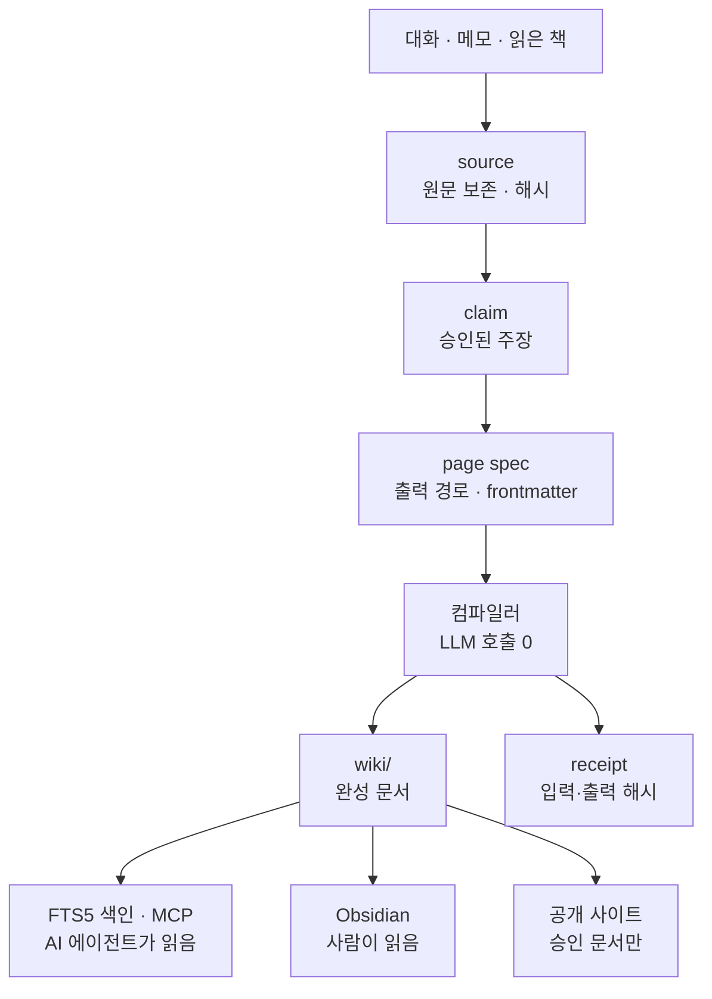

# Woon Core
{: .no_toc }

이 사이트의 문서는 사람이 파일을 직접 고쳐서 만들지 않는다. 원자료를 **source**로 보존하고, 그 source를 가리키는 **claim**을 승인한 다음, LLM을 한 번도 호출하지 않는 컴파일러가 claim을 결합해 페이지를 생성한다. 그래서 문장마다 어느 기록에서 나왔는지 되짚을 수 있고, 같은 입력에서 같은 바이트가 나온다.

## 원자료에서 공개 사이트까지

컴파일 결과인 `wiki/` 폴더는 사람이 읽는 정본인 동시에 색인과 공개 투영의 입력이다. 여기에서 세 갈래로 갈린다. FTS5 색인과 MCP를 경유해 AI 에이전트가 읽고, 사람은 Obsidian에서 같은 폴더를 열며, 승인된 페이지만 공개 사이트로 배포된다. 색인은 필요한 시점에 생성되고 MCP 프로세스가 연결된 동안에만 유지되므로 상주 프로세스가 없다.

## 각 게이트가 무엇을 거부하는가

파이프라인의 각 단계에는 통과 조건이 있다. 조건을 만족하지 않으면 페이지가 만들어지지 않는다. 부분 적용은 없다.

| 게이트 | 거부하는 것 | 남는 결과 |
| --- | --- | --- |
| source 등록 | 보존 목적(`purpose`)이 비어 있는 새 source | 원문은 저장되지 않고 등록이 실패한다 |
| claim 승인 | 존재하지 않는 source를 가리키는 claim, 승인되지 않은(`accepted`가 아닌) claim | 검토 대기열에 남고 페이지 본문이 되지 않는다 |
| 공개 범위 | 공개 페이지가 비공개 source를 근거로 삼는 경우 | `public compiled page requires public source provenance`로 컴파일 전체가 중단된다 |
| 출력 대조 | 컴파일러가 소유한 본문을 사람이 직접 고친 경우 | receipt의 입력·출력 해시가 어긋나 감사에서 오류로 잡힌다 |
| 탐색 계약 | 같은 식별 키워드를 두 문서가 쓰는 경우, `navigation_groups`가 직접 하위 문서를 빠뜨린 경우 | 트리 갱신이 멈추고 감사가 위반을 보고한다 |
| 공개 투영 | Obsidian 위키링크, 로컬 파일 경로, 비공개 자료로 가는 링크, 원본 대화 ID가 남은 본문 | 해당 페이지는 사이트 입력으로 나가지 않는다 |
| 공개 투영 | 본문이 없는 키워드 문서(`content_status: planned`) | 빈 페이지를 배포하지 않는다. 다만 배포되는 문서의 조상은 탐색을 위해 남긴다 |

## 두 개의 해시가 서로 다른 것을 지킨다

receipt에는 해시가 둘 있다.

- `compiler_projection_sha256` — source·claim·page spec이 소유한 **컴파일러 본문**을 검증한다.
- `output_sha256` — 그 컴파일 시점의 **파일 전체**를 추적한다.

둘을 나눈 이유는 한 파일 안에 소유자가 다른 영역이 공존하기 때문이다. 하위 문서 목록처럼 Core가 생성하는 블록이 갱신되면 파일 전체 해시는 달라지지만, 컴파일러 본문이 그대로 재현되면 낡은 상태가 아니다. 반대로 표시 블록 바깥의 컴파일러 본문이 바뀌면 그때는 오류다.

## 이 구조가 보장하지 않는 것

한 가지는 분명히 밝혀 두어야 한다. **이 구조는 환각을 차단하지 않는다.** 컴파일러가 검증하는 대상은 claim이 참조하는 source의 존재 여부와 해시 일치이지, claim의 내용이 source에 실제로 존재하는지가 아니다. 문장이 어느 기록에서 왔는지 되짚을 수 있게 만들 뿐, 그 문장이 그 기록의 내용과 맞는지는 사람의 검토가 판정한다.

대가도 있다. 승인된 claim이 없는 주제는 페이지가 생성되지 않으므로 문서 증가 속도가 느리다. 공개 투영도 페이지 단위 승인이라 한 번에 많이 공개하기 어렵다.
